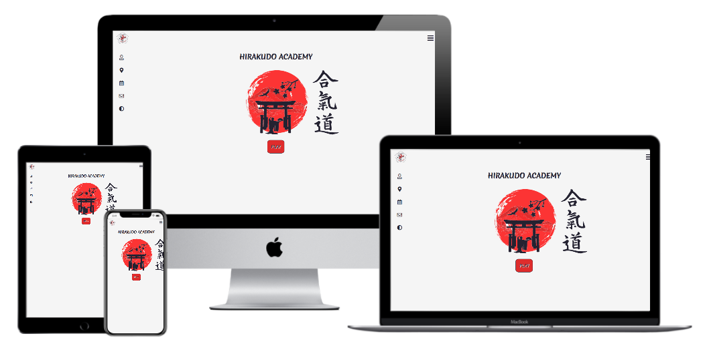

# Hirakudo Academy

**Code Institute - Milestone Project for Interactive Frontend Development**

[View webpage in GitHub Pages](https://github.com/maxthor500/Hirakudo-Academy)



This project is the second Milestone Project that make up the Full Stack Developer course at the Code Institute.

The project purpose is to build an interactive front-end site. The site should respond to the users' actions, allowing users to actively engage with data, alter the way the site displays the information to achieve their preferred goals through the main use of HTML, CSS and Javascript.

[Click here to see the website live](https://maxthor500.github.io/Hirakudo-Academy/)

## User Experience

The website is a tribute to my aikido master, where the users can find information on him, the days when he has lessons and a memory game to learn and repeat the main techniques.

### User Stories

- as a user I am looking for a responsive web design so that I am able to display content of website adequately to the device.
- as a new user I am looking for a website where I can learn the names of the aikido techniques so that I can name the aikido techniques.
- as a user I want get to know the Master del Plato and where he practises so that I can know him better.
- as a user who has participated in aikido stage I can find more information about master so that I can know him better without asking other people about him
- as a recurring user I need to know where is located the aikido dojo so that I can find information at what time and where will take place the aikido lesson today
- as a recurring user I would like to find easy way to practise aikido so that by the game I can learn names of the aikido techniques
- as a new user I am looking for simple website to visit so that I can easily find all the information about the aikido which take place in Battipaglia and Eboli.
- as a user I can find the name of 'aikido' in Japanese.
- as a user I can use dark mode so that I can quickly turn the screen do dark whenever I want.
- as a user I can contact the website founder so that I can send him a message if I want know more about the website or aikido
- as a user I can use the map so that I can check the map of all the earth
- as a user I can use the calendar so that I can check all the aikido events today.
- as a user I can find how looks like the logo of the Hirakudo Academy.

### Strategy

My design goal is to make up everything the information as easy as possible making the UX simple and fun.

The website shows all the information about the Hirakudo Academy.
It does not look like the website of other gyms/dojos. It designed to entertain the user and practice the techniques by playing a simple game like memory.

### Scope

I would like to provide the possibility to users to know the Master Del Plato and the Aikido.

### Structure

I started developing my wireframes using Balsamiq for each page on mobile, tablet and laptop/desktop.

### Skeleton

*  [Wireframes](./assets/mockup/Hirakudo-wireframe.pdf) PDF file.


### Surface

I next moved onto the design work of the website.

##### Colour Scheme

The colours are inspired by the Hirakudo Academy logo, so I tried to create an attractive design by balancing the three colours: white, black and red.

##### Typography

I used Google Fonts to select the fonts for my project.
The' Merienda One' font is the main font used throughout the whole website with cursive as the fall-back font in the case for any reason the font isn't being imported into the site correctly.

I chose this font because the stroke looks like a Japanese kanji, in my opinion.

I used the 'Roboto' font for the description modal with sans-serif as the fall-back font, with the main font the reading seemed too thoughtful.

##### Imagery

I used the Hirakudo Academy logo, a hero image acquired from [Google Images](https://www.google.com/images) and adapted and rendered vector with [Gimp](https://www.gimp.org/) and [Inkscape](https://inkscape.org/).

## Features

The project consists of one main page, where the users can access every information through the menu in the navbar.
The users can start to play the memory game that is the main attraction of the site.

**Consistent features across all pages:**

-	The fixed navbar contain the logo and a button that open a sidebar.
-	Each page is responsive.

The Navigation Bar is hidden to the side on mobile devices while a fixed sidebar appears on desktops.

The navigation bar has five buttons.  The buttons direct to the information of Maestro Del Plato: "who is it?", "where is the dojo?" "when is there an event?" "How to contact him?". The last button allows you to show the site in dark mode.
The initial idea was to open modals for each button.

Following the advice of my mentor, I created additional pages that display the map and the calendar.
I wanted to leave the description and the form in the modal form.

The navbar in the map, calendar and game pages includes an icon to return to the homepage and an icon that manages the dark mode.

Each screen shows the Homepage with a hero image and a button that directs to the memory game.

The aikido kanji show itself by increasing the screen size.

### Features left to Implement

In the future, I would like:

* to add a footer with the links to the social networks.
* to add a gallery.
* to standardize every links to modal or pages.
* to make a calendar class so that the user can watch every event in the calendar, not just today.
* option to choose the language of the website.
* to add a new game to help users have interactive aikido learning.
* to add some video lessons of Master Del Plato.
* to add the links to the demonstration video of the techniques shown in the memory game.


## Technologies used

**Languages, libraries, frameworks, editors and version control**

* HTML5
  * The language used to create the form and add content to the website.
* CSS3
  * The language used to style the HTML5 elements.
* Javascript
* [Font Awesome](https://fontawesome.com)
* [EmailJS](https://www.emailjs.com/) to make the form interactive.
* [LeafLetJS](https://leafletjs.com/) to render the map 
* [JQuery](https://jquery.com/)
* Visual Studio Code
* [Gitpod](https://www.gitpod.io/)
  * I used Gitpod's development environment to write the code for the website.
* [Git Version Control](https://git-scm.com/)
  * I used Git for Version Control to record changes and updates to my files
* [GitHub](https://github.com/)
  * I used GitHub’s repository hosting service to host my deployed website as well as track previous versions of my code 

**Other tools used:**

* [Balsamiq](https://balsamiq.com/)
  * I used Balsamiq to create wireframes for my project for desktop, tablet and smartphone.
* [Google Images](https://www.google.com/images)
  * This was the source for the images in my project.
* [Google Fonts](https://fonts.google.com/)
* [W3Schools](https://www.w3schools.com/css/default.asp)
  - It was helpful with all my CSS doubts.
* [Techsini](http://techsini.com/multi-mockup/index.php)
* [AutoPrefixer](https://autoprefixer.github.io/)
  - This project used **AutoPrefixer** to make sure the CSS code is valid for all browsers.
* [Typora](https://typora.io/)
* [Chrome DevTools](https://developers.google.com/web/tools/chrome-devtools)

*Note: I also found [Stack Overflow](https://stackoverflow.com/), [W3C Schools](https://www.w3schools.com/) and [MDN Web Docs](https://developer.mozilla.org/en-US/) helpful resources throughout the project, as well as the Code Institute Slack Community. 

## Testing

Testing information can be found in separate [TESTING.md](TESTING.md) file.


## Deployment

This project was developed using the [Gitpod](https://www.gitpod.io/), committed to git and pushed to GitHub using the built-in function within git.

To deploy this page to GitHub Pages from its [GitHub repository](https://github.com/maxthor500/Hirakudo-Academy), the following steps were taken:

1. Log into GitHub.
2. From the list of repositories on the screen, select **maxthor500/Hirakudo-Academy.
3. From the menu items near the top of the page, select **Settings**.
4. Scroll down to the **GitHub Pages** section.
5. Under **Source** click the drop-down menu labelled **None** and select **Master Branch**
6. On selecting Master Branch the page is automatically refreshed, the website is now deployed.
7. Scroll back down to the **GitHub Pages** section to retrieve the link to the deployed website.

**How to run this project locally**

To clone this project into Gitpod you will need:

1. A GitHub account. [Create a Github account here](https://github.com/)
2. Use the Chrome browser

Then follow these steps:

1. Install the [Gitpod Browser Extensions for Chrome](https://www.gitpod.io/docs/browser-extension/)
2. After installation, restart the browser
3. Log into [Gitpod](https://gitpod.com/) with your Gitpod account.
4. Navigate to the [Project GitHub repository](https://github.com/maxthor500/Hirakudo-Academy)
5. Click the green "Gitpod" button in the top right corner of the repository
6. This will trigger a new Gitpod workspace to be created from the code in GitHub where you can work locally.

To work on the project code within a local IDE such as VSCode, Pycharm etc:

1. Follow this link to the [project GitHub repository](https://github.com/maxthor500/Finding-Campania).
2. Under the repository name, click "Clone or download".
3. In the Clone with HTTPs section, copy the clone URL for the repository.
4. In your local IDE open the terminal.
5. Change the current working directory to the location where you want the cloned directory to be made.
6. Type `git clone`, and then paste the URL you copied in Step 3.

```
git clone https://github.com/USERNAME/REPOSITORY
```

1. Press Enter. Your local clone will be created.

Further reading and troubleshooting on cloning a repository from GitHub [here](https://help.github.com/en/articles/cloning-a-repository).

## Credits

#### 	Media

- Hirakudo Academy Logo.
- My photo of the dojo.

#### 	Code

- from [JaeWong91](https://github.com/JaeWong91/MS2-Marvel-Game)  I used to code the class of the memory game.

- from [Code-Sketch](https://github.com/code-sketch/memory-game/) I used to style the memory game.

- from [laschaNoz](https://github.com/lashaNoz/Calendar/) I used the calendar script and the calendar style.

- from [W3Schools](https://www.w3schools.com/css/default.asp) I took the button and the modals styles.

- from [CodingNepal](https://www.codingnepalweb.com/2020/04/responsive-menu-bar-in-html-css.html) I used to style the navbar.

- from [CodingSnow](https://www.codingsnow.com/2021/01/responsive-sidebar-menu-dashboard.html ) I used to style the sidebar.


#### 	Acknowledgements

I would like to thank the following:

* My mentor, **Spencer Barriball**, for his guidance, wisdom and encouragement throughout the project.

* **CI Staff** and **Slack Community** for their assistance with minor coding issues.

* My fiance, **Vanessa**, for his users stories.

**The content of this website is for educational purposes only.**

Thanks for taking the time to view my README. I hope you enjoyed your visit to my page.